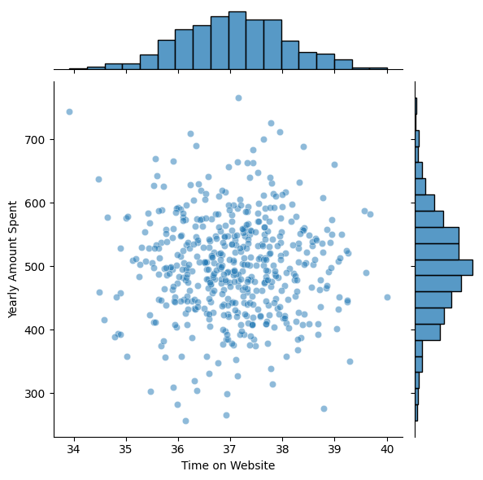
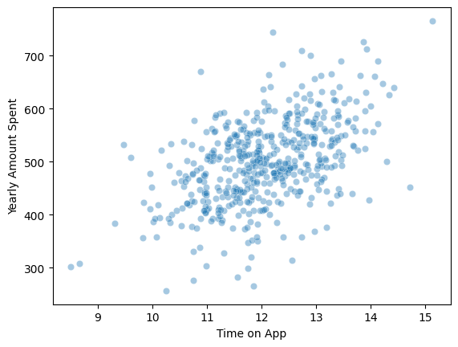
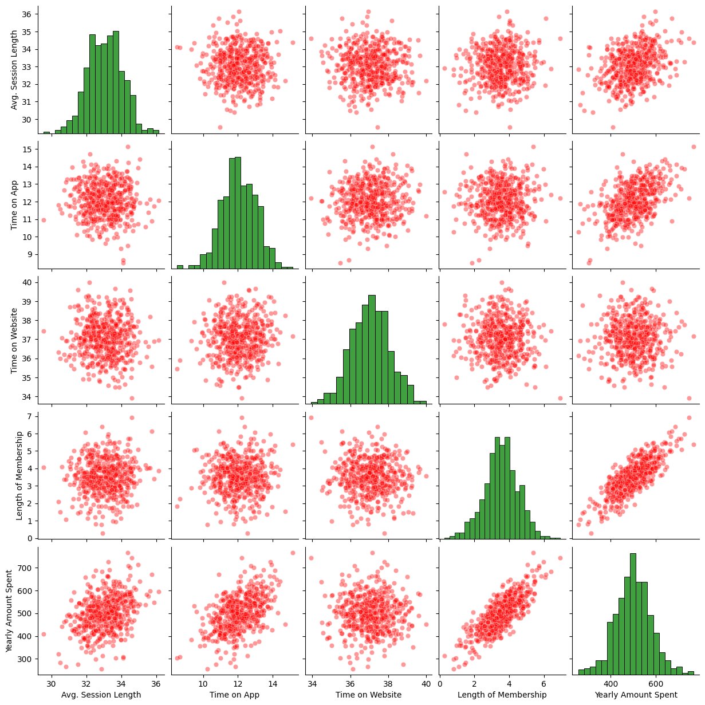
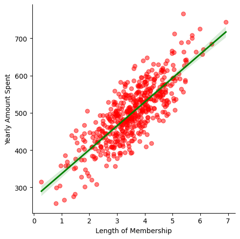
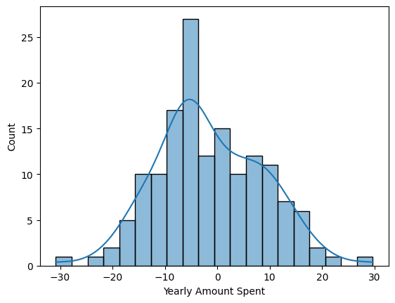
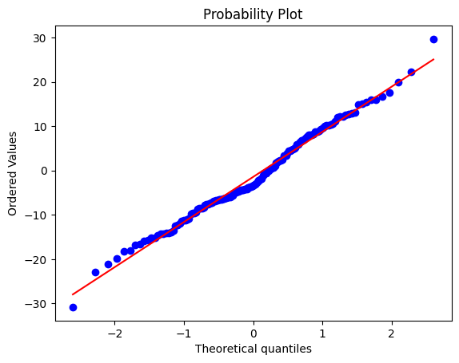

# Customer Spending Prediction using Linear Regression

### Import libraries


```python
import pandas as pd
import matplotlib.pyplot as plt
import seaborn as sns
```

### Read CSV file on Ecommerse dataset


```python
df = pd.read_csv('Ecommerce.csv')
```

### Tabel info


```python
df.info()
```

    <class 'pandas.core.frame.DataFrame'>
    RangeIndex: 500 entries, 0 to 499
    Data columns (total 8 columns):
     #   Column                Non-Null Count  Dtype  
    ---  ------                --------------  -----  
     0   Email                 500 non-null    object 
     1   Address               500 non-null    object 
     2   Avatar                500 non-null    object 
     3   Avg. Session Length   500 non-null    float64
     4   Time on App           500 non-null    float64
     5   Time on Website       500 non-null    float64
     6   Length of Membership  500 non-null    float64
     7   Yearly Amount Spent   500 non-null    float64
    dtypes: float64(5), object(3)
    memory usage: 31.4+ KB
    

### basic statistical information


```python
df.describe()
```


<div>
<style scoped>
    .dataframe tbody tr th:only-of-type {
        vertical-align: middle;
    }

    .dataframe tbody tr th {
        vertical-align: top;
    }

    .dataframe thead th {
        text-align: right;
    }
</style>
<table border="1" class="dataframe">
  <thead>
    <tr style="text-align: right;">
      <th></th>
      <th>Avg. Session Length</th>
      <th>Time on App</th>
      <th>Time on Website</th>
      <th>Length of Membership</th>
      <th>Yearly Amount Spent</th>
    </tr>
  </thead>
  <tbody>
    <tr>
      <th>count</th>
      <td>500.000000</td>
      <td>500.000000</td>
      <td>500.000000</td>
      <td>500.000000</td>
      <td>500.000000</td>
    </tr>
    <tr>
      <th>mean</th>
      <td>33.053194</td>
      <td>12.052488</td>
      <td>37.060445</td>
      <td>3.533462</td>
      <td>499.314038</td>
    </tr>
    <tr>
      <th>std</th>
      <td>0.992563</td>
      <td>0.994216</td>
      <td>1.010489</td>
      <td>0.999278</td>
      <td>79.314782</td>
    </tr>
    <tr>
      <th>min</th>
      <td>29.532429</td>
      <td>8.508152</td>
      <td>33.913847</td>
      <td>0.269901</td>
      <td>256.670582</td>
    </tr>
    <tr>
      <th>25%</th>
      <td>32.341822</td>
      <td>11.388153</td>
      <td>36.349257</td>
      <td>2.930450</td>
      <td>445.038277</td>
    </tr>
    <tr>
      <th>50%</th>
      <td>33.082008</td>
      <td>11.983231</td>
      <td>37.069367</td>
      <td>3.533975</td>
      <td>498.887875</td>
    </tr>
    <tr>
      <th>75%</th>
      <td>33.711985</td>
      <td>12.753850</td>
      <td>37.716432</td>
      <td>4.126502</td>
      <td>549.313828</td>
    </tr>
    <tr>
      <th>max</th>
      <td>36.139662</td>
      <td>15.126994</td>
      <td>40.005182</td>
      <td>6.922689</td>
      <td>765.518462</td>
    </tr>
  </tbody>
</table>
</div>


### Trying to find any kind of relationship between customer spent and time on website


```python
sns.jointplot(x='Time on Website', y = 'Yearly Amount Spent', data = df, alpha=0.5)
```


    <seaborn.axisgrid.JointGrid at 0x1664a8dcac0>


    

    


### NO real relation could be found, lets relate to Time on App


```python
sns.scatterplot(x = 'Time on App', y = 'Yearly Amount Spent', data = df , alpha =0.4)
```


    <Axes: xlabel='Time on App', ylabel='Yearly Amount Spent'>


    

    


### Let us try some pairplots 


```python
sns.pairplot(df, kind='scatter', plot_kws={'alpha':0.4, 'color':'red'}, diag_kws={'color':'green'})
```


    <seaborn.axisgrid.PairGrid at 0x1665fe2e160>


    

    


### Linear model example


```python
sns.lmplot(x='Length of Membership', y = 'Yearly Amount Spent', data = df, scatter_kws={'alpha':0.5, 'color':'red'}, line_kws={'color':'Green'})
```


    <seaborn.axisgrid.FacetGrid at 0x16664f68970>


    

    


### Split the data into training and testing set


```python
df.info()
```

    <class 'pandas.core.frame.DataFrame'>
    RangeIndex: 500 entries, 0 to 499
    Data columns (total 8 columns):
     #   Column                Non-Null Count  Dtype  
    ---  ------                --------------  -----  
     0   Email                 500 non-null    object 
     1   Address               500 non-null    object 
     2   Avatar                500 non-null    object 
     3   Avg. Session Length   500 non-null    float64
     4   Time on App           500 non-null    float64
     5   Time on Website       500 non-null    float64
     6   Length of Membership  500 non-null    float64
     7   Yearly Amount Spent   500 non-null    float64
    dtypes: float64(5), object(3)
    memory usage: 31.4+ KB
    

### - import sklearn
### - define Dependent and independent variable, we will be predicting yearly amount spent by customers based on data


```python
from sklearn.model_selection import train_test_split
X = df[['Avg. Session Length','Time on App','Time on Website','Length of Membership']]
y = df['Yearly Amount Spent']
X_train, X_test, y_train, y_test = train_test_split(X, y, test_size=0.3, random_state=42)
```

#### verify the splits


```python
X_test.info()
```

    <class 'pandas.core.frame.DataFrame'>
    Index: 150 entries, 361 to 426
    Data columns (total 4 columns):
     #   Column                Non-Null Count  Dtype  
    ---  ------                --------------  -----  
     0   Avg. Session Length   150 non-null    float64
     1   Time on App           150 non-null    float64
     2   Time on Website       150 non-null    float64
     3   Length of Membership  150 non-null    float64
    dtypes: float64(4)
    memory usage: 5.9 KB
    

### Train LM model


```python
from sklearn.linear_model import LinearRegression
lm = LinearRegression()
lm.fit(X_train, y_train)
```


<style>#sk-container-id-1 {
  /* Definition of color scheme common for light and dark mode */
  --sklearn-color-text: #000;
  --sklearn-color-text-muted: #666;
  --sklearn-color-line: gray;
  /* Definition of color scheme for unfitted estimators */
  --sklearn-color-unfitted-level-0: #fff5e6;
  --sklearn-color-unfitted-level-1: #f6e4d2;
  --sklearn-color-unfitted-level-2: #ffe0b3;
  --sklearn-color-unfitted-level-3: chocolate;
  /* Definition of color scheme for fitted estimators */
  --sklearn-color-fitted-level-0: #f0f8ff;
  --sklearn-color-fitted-level-1: #d4ebff;
  --sklearn-color-fitted-level-2: #b3dbfd;
  --sklearn-color-fitted-level-3: cornflowerblue;

  /* Specific color for light theme */
  --sklearn-color-text-on-default-background: var(--sg-text-color, var(--theme-code-foreground, var(--jp-content-font-color1, black)));
  --sklearn-color-background: var(--sg-background-color, var(--theme-background, var(--jp-layout-color0, white)));
  --sklearn-color-border-box: var(--sg-text-color, var(--theme-code-foreground, var(--jp-content-font-color1, black)));
  --sklearn-color-icon: #696969;

  @media (prefers-color-scheme: dark) {
    /* Redefinition of color scheme for dark theme */
    --sklearn-color-text-on-default-background: var(--sg-text-color, var(--theme-code-foreground, var(--jp-content-font-color1, white)));
    --sklearn-color-background: var(--sg-background-color, var(--theme-background, var(--jp-layout-color0, #111)));
    --sklearn-color-border-box: var(--sg-text-color, var(--theme-code-foreground, var(--jp-content-font-color1, white)));
    --sklearn-color-icon: #878787;
  }
}

#sk-container-id-1 {
  color: var(--sklearn-color-text);
}

#sk-container-id-1 pre {
  padding: 0;
}

#sk-container-id-1 input.sk-hidden--visually {
  border: 0;
  clip: rect(1px 1px 1px 1px);
  clip: rect(1px, 1px, 1px, 1px);
  height: 1px;
  margin: -1px;
  overflow: hidden;
  padding: 0;
  position: absolute;
  width: 1px;
}

#sk-container-id-1 div.sk-dashed-wrapped {
  border: 1px dashed var(--sklearn-color-line);
  margin: 0 0.4em 0.5em 0.4em;
  box-sizing: border-box;
  padding-bottom: 0.4em;
  background-color: var(--sklearn-color-background);
}

#sk-container-id-1 div.sk-container {
  /* jupyter's `normalize.less` sets `[hidden] { display: none; }`
     but bootstrap.min.css set `[hidden] { display: none !important; }`
     so we also need the `!important` here to be able to override the
     default hidden behavior on the sphinx rendered scikit-learn.org.
     See: https://github.com/scikit-learn/scikit-learn/issues/21755 */
  display: inline-block !important;
  position: relative;
}

#sk-container-id-1 div.sk-text-repr-fallback {
  display: none;
}

div.sk-parallel-item,
div.sk-serial,
div.sk-item {
  /* draw centered vertical line to link estimators */
  background-image: linear-gradient(var(--sklearn-color-text-on-default-background), var(--sklearn-color-text-on-default-background));
  background-size: 2px 100%;
  background-repeat: no-repeat;
  background-position: center center;
}

/* Parallel-specific style estimator block */

#sk-container-id-1 div.sk-parallel-item::after {
  content: "";
  width: 100%;
  border-bottom: 2px solid var(--sklearn-color-text-on-default-background);
  flex-grow: 1;
}

#sk-container-id-1 div.sk-parallel {
  display: flex;
  align-items: stretch;
  justify-content: center;
  background-color: var(--sklearn-color-background);
  position: relative;
}

#sk-container-id-1 div.sk-parallel-item {
  display: flex;
  flex-direction: column;
}

#sk-container-id-1 div.sk-parallel-item:first-child::after {
  align-self: flex-end;
  width: 50%;
}

#sk-container-id-1 div.sk-parallel-item:last-child::after {
  align-self: flex-start;
  width: 50%;
}

#sk-container-id-1 div.sk-parallel-item:only-child::after {
  width: 0;
}

/* Serial-specific style estimator block */

#sk-container-id-1 div.sk-serial {
  display: flex;
  flex-direction: column;
  align-items: center;
  background-color: var(--sklearn-color-background);
  padding-right: 1em;
  padding-left: 1em;
}


/* Toggleable style: style used for estimator/Pipeline/ColumnTransformer box that is
clickable and can be expanded/collapsed.
- Pipeline and ColumnTransformer use this feature and define the default style
- Estimators will overwrite some part of the style using the `sk-estimator` class
*/

/* Pipeline and ColumnTransformer style (default) */

#sk-container-id-1 div.sk-toggleable {
  /* Default theme specific background. It is overwritten whether we have a
  specific estimator or a Pipeline/ColumnTransformer */
  background-color: var(--sklearn-color-background);
}

/* Toggleable label */
#sk-container-id-1 label.sk-toggleable__label {
  cursor: pointer;
  display: flex;
  width: 100%;
  margin-bottom: 0;
  padding: 0.5em;
  box-sizing: border-box;
  text-align: center;
  align-items: start;
  justify-content: space-between;
  gap: 0.5em;
}

#sk-container-id-1 label.sk-toggleable__label .caption {
  font-size: 0.6rem;
  font-weight: lighter;
  color: var(--sklearn-color-text-muted);
}

#sk-container-id-1 label.sk-toggleable__label-arrow:before {
  /* Arrow on the left of the label */
  content: "▸";
  float: left;
  margin-right: 0.25em;
  color: var(--sklearn-color-icon);
}

#sk-container-id-1 label.sk-toggleable__label-arrow:hover:before {
  color: var(--sklearn-color-text);
}

/* Toggleable content - dropdown */

#sk-container-id-1 div.sk-toggleable__content {
  max-height: 0;
  max-width: 0;
  overflow: hidden;
  text-align: left;
  /* unfitted */
  background-color: var(--sklearn-color-unfitted-level-0);
}

#sk-container-id-1 div.sk-toggleable__content.fitted {
  /* fitted */
  background-color: var(--sklearn-color-fitted-level-0);
}

#sk-container-id-1 div.sk-toggleable__content pre {
  margin: 0.2em;
  border-radius: 0.25em;
  color: var(--sklearn-color-text);
  /* unfitted */
  background-color: var(--sklearn-color-unfitted-level-0);
}

#sk-container-id-1 div.sk-toggleable__content.fitted pre {
  /* unfitted */
  background-color: var(--sklearn-color-fitted-level-0);
}

#sk-container-id-1 input.sk-toggleable__control:checked~div.sk-toggleable__content {
  /* Expand drop-down */
  max-height: 200px;
  max-width: 100%;
  overflow: auto;
}

#sk-container-id-1 input.sk-toggleable__control:checked~label.sk-toggleable__label-arrow:before {
  content: "▾";
}

/* Pipeline/ColumnTransformer-specific style */

#sk-container-id-1 div.sk-label input.sk-toggleable__control:checked~label.sk-toggleable__label {
  color: var(--sklearn-color-text);
  background-color: var(--sklearn-color-unfitted-level-2);
}

#sk-container-id-1 div.sk-label.fitted input.sk-toggleable__control:checked~label.sk-toggleable__label {
  background-color: var(--sklearn-color-fitted-level-2);
}

/* Estimator-specific style */

/* Colorize estimator box */
#sk-container-id-1 div.sk-estimator input.sk-toggleable__control:checked~label.sk-toggleable__label {
  /* unfitted */
  background-color: var(--sklearn-color-unfitted-level-2);
}

#sk-container-id-1 div.sk-estimator.fitted input.sk-toggleable__control:checked~label.sk-toggleable__label {
  /* fitted */
  background-color: var(--sklearn-color-fitted-level-2);
}

#sk-container-id-1 div.sk-label label.sk-toggleable__label,
#sk-container-id-1 div.sk-label label {
  /* The background is the default theme color */
  color: var(--sklearn-color-text-on-default-background);
}

/* On hover, darken the color of the background */
#sk-container-id-1 div.sk-label:hover label.sk-toggleable__label {
  color: var(--sklearn-color-text);
  background-color: var(--sklearn-color-unfitted-level-2);
}

/* Label box, darken color on hover, fitted */
#sk-container-id-1 div.sk-label.fitted:hover label.sk-toggleable__label.fitted {
  color: var(--sklearn-color-text);
  background-color: var(--sklearn-color-fitted-level-2);
}

/* Estimator label */

#sk-container-id-1 div.sk-label label {
  font-family: monospace;
  font-weight: bold;
  display: inline-block;
  line-height: 1.2em;
}

#sk-container-id-1 div.sk-label-container {
  text-align: center;
}

/* Estimator-specific */
#sk-container-id-1 div.sk-estimator {
  font-family: monospace;
  border: 1px dotted var(--sklearn-color-border-box);
  border-radius: 0.25em;
  box-sizing: border-box;
  margin-bottom: 0.5em;
  /* unfitted */
  background-color: var(--sklearn-color-unfitted-level-0);
}

#sk-container-id-1 div.sk-estimator.fitted {
  /* fitted */
  background-color: var(--sklearn-color-fitted-level-0);
}

/* on hover */
#sk-container-id-1 div.sk-estimator:hover {
  /* unfitted */
  background-color: var(--sklearn-color-unfitted-level-2);
}

#sk-container-id-1 div.sk-estimator.fitted:hover {
  /* fitted */
  background-color: var(--sklearn-color-fitted-level-2);
}

/* Specification for estimator info (e.g. "i" and "?") */

/* Common style for "i" and "?" */

.sk-estimator-doc-link,
a:link.sk-estimator-doc-link,
a:visited.sk-estimator-doc-link {
  float: right;
  font-size: smaller;
  line-height: 1em;
  font-family: monospace;
  background-color: var(--sklearn-color-background);
  border-radius: 1em;
  height: 1em;
  width: 1em;
  text-decoration: none !important;
  margin-left: 0.5em;
  text-align: center;
  /* unfitted */
  border: var(--sklearn-color-unfitted-level-1) 1pt solid;
  color: var(--sklearn-color-unfitted-level-1);
}

.sk-estimator-doc-link.fitted,
a:link.sk-estimator-doc-link.fitted,
a:visited.sk-estimator-doc-link.fitted {
  /* fitted */
  border: var(--sklearn-color-fitted-level-1) 1pt solid;
  color: var(--sklearn-color-fitted-level-1);
}

/* On hover */
div.sk-estimator:hover .sk-estimator-doc-link:hover,
.sk-estimator-doc-link:hover,
div.sk-label-container:hover .sk-estimator-doc-link:hover,
.sk-estimator-doc-link:hover {
  /* unfitted */
  background-color: var(--sklearn-color-unfitted-level-3);
  color: var(--sklearn-color-background);
  text-decoration: none;
}

div.sk-estimator.fitted:hover .sk-estimator-doc-link.fitted:hover,
.sk-estimator-doc-link.fitted:hover,
div.sk-label-container:hover .sk-estimator-doc-link.fitted:hover,
.sk-estimator-doc-link.fitted:hover {
  /* fitted */
  background-color: var(--sklearn-color-fitted-level-3);
  color: var(--sklearn-color-background);
  text-decoration: none;
}

/* Span, style for the box shown on hovering the info icon */
.sk-estimator-doc-link span {
  display: none;
  z-index: 9999;
  position: relative;
  font-weight: normal;
  right: .2ex;
  padding: .5ex;
  margin: .5ex;
  width: min-content;
  min-width: 20ex;
  max-width: 50ex;
  color: var(--sklearn-color-text);
  box-shadow: 2pt 2pt 4pt #999;
  /* unfitted */
  background: var(--sklearn-color-unfitted-level-0);
  border: .5pt solid var(--sklearn-color-unfitted-level-3);
}

.sk-estimator-doc-link.fitted span {
  /* fitted */
  background: var(--sklearn-color-fitted-level-0);
  border: var(--sklearn-color-fitted-level-3);
}

.sk-estimator-doc-link:hover span {
  display: block;
}

/* "?"-specific style due to the `<a>` HTML tag */

#sk-container-id-1 a.estimator_doc_link {
  float: right;
  font-size: 1rem;
  line-height: 1em;
  font-family: monospace;
  background-color: var(--sklearn-color-background);
  border-radius: 1rem;
  height: 1rem;
  width: 1rem;
  text-decoration: none;
  /* unfitted */
  color: var(--sklearn-color-unfitted-level-1);
  border: var(--sklearn-color-unfitted-level-1) 1pt solid;
}

#sk-container-id-1 a.estimator_doc_link.fitted {
  /* fitted */
  border: var(--sklearn-color-fitted-level-1) 1pt solid;
  color: var(--sklearn-color-fitted-level-1);
}

/* On hover */
#sk-container-id-1 a.estimator_doc_link:hover {
  /* unfitted */
  background-color: var(--sklearn-color-unfitted-level-3);
  color: var(--sklearn-color-background);
  text-decoration: none;
}

#sk-container-id-1 a.estimator_doc_link.fitted:hover {
  /* fitted */
  background-color: var(--sklearn-color-fitted-level-3);
}
</style><div id="sk-container-id-1" class="sk-top-container"><div class="sk-text-repr-fallback"><pre>LinearRegression()</pre><b>In a Jupyter environment, please rerun this cell to show the HTML representation or trust the notebook. <br />On GitHub, the HTML representation is unable to render, please try loading this page with nbviewer.org.</b></div><div class="sk-container" hidden><div class="sk-item"><div class="sk-estimator fitted sk-toggleable"><input class="sk-toggleable__control sk-hidden--visually" id="sk-estimator-id-1" type="checkbox" checked><label for="sk-estimator-id-1" class="sk-toggleable__label fitted sk-toggleable__label-arrow"><div><div>LinearRegression</div></div><div><a class="sk-estimator-doc-link fitted" rel="noreferrer" target="_blank" href="https://scikit-learn.org/1.6/modules/generated/sklearn.linear_model.LinearRegression.html">?<span>Documentation for LinearRegression</span></a><span class="sk-estimator-doc-link fitted">i<span>Fitted</span></span></div></label><div class="sk-toggleable__content fitted"><pre>LinearRegression()</pre></div> </div></div></div></div>


#### make prediction on test set X_test


```python
prediction = lm.predict(X_test)
```

#### check for errors


```python
from sklearn.metrics import mean_absolute_error, mean_squared_error
import math
print(f'mean_absolute_error = {mean_absolute_error(y_test, prediction)}$')
print(f'mean_squared_error  = {mean_squared_error(y_test, prediction)}$')
print(f'RMSE = {math.sqrt(mean_squared_error(y_test, prediction))}$')
```

    mean_absolute_error = 8.426091641432116$
    mean_squared_error  = 103.91554136503333$
    RMSE = 10.193897260863155$
    

### check fo normality


```python
residual = y_test - prediction
sns.histplot(residual, bins= 20, kde=True)
```


    <Axes: xlabel='Yearly Amount Spent', ylabel='Count'>


    

    


### Q-Q plot to if the distribution is normal


```python
import pylab
import scipy.stats as stats
stats.probplot(residual, dist='norm', plot=pylab)
```


    ((array([-2.60376328, -2.283875  , -2.1005573 , -1.96875864, -1.86428437,
             -1.77691182, -1.70131573, -1.63435332, -1.57400778, -1.51890417,
             -1.46806125, -1.42075308, -1.37642684, -1.33465133, -1.29508341,
             -1.25744533, -1.22150891, -1.18708433, -1.15401181, -1.12215558,
             -1.0913992 , -1.06164202, -1.03279638, -1.00478546, -0.97754152,
             -0.95100448, -0.92512081, -0.89984257, -0.87512664, -0.85093408,
             -0.8272296 , -0.80398107, -0.78115919, -0.75873709, -0.73669013,
             -0.71499557, -0.69363244, -0.67258128, -0.65182406, -0.63134396,
             -0.61112532, -0.59115349, -0.57141472, -0.55189613, -0.53258558,
             -0.51347162, -0.49454346, -0.47579085, -0.45720409, -0.43877397,
             -0.4204917 , -0.40234892, -0.38433762, -0.36645016, -0.3486792 ,
             -0.33101768, -0.31345882, -0.29599609, -0.27862316, -0.26133393,
             -0.24412247, -0.22698303, -0.20991002, -0.19289797, -0.17594158,
             -0.15903562, -0.142175  , -0.12535471, -0.10856981, -0.09181544,
             -0.07508681, -0.05837916, -0.0416878 , -0.02500804, -0.00833524,
              0.00833524,  0.02500804,  0.0416878 ,  0.05837916,  0.07508681,
              0.09181544,  0.10856981,  0.12535471,  0.142175  ,  0.15903562,
              0.17594158,  0.19289797,  0.20991002,  0.22698303,  0.24412247,
              0.26133393,  0.27862316,  0.29599609,  0.31345882,  0.33101768,
              0.3486792 ,  0.36645016,  0.38433762,  0.40234892,  0.4204917 ,
              0.43877397,  0.45720409,  0.47579085,  0.49454346,  0.51347162,
              0.53258558,  0.55189613,  0.57141472,  0.59115349,  0.61112532,
              0.63134396,  0.65182406,  0.67258128,  0.69363244,  0.71499557,
              0.73669013,  0.75873709,  0.78115919,  0.80398107,  0.8272296 ,
              0.85093408,  0.87512664,  0.89984257,  0.92512081,  0.95100448,
              0.97754152,  1.00478546,  1.03279638,  1.06164202,  1.0913992 ,
              1.12215558,  1.15401181,  1.18708433,  1.22150891,  1.25744533,
              1.29508341,  1.33465133,  1.37642684,  1.42075308,  1.46806125,
              1.51890417,  1.57400778,  1.63435332,  1.70131573,  1.77691182,
              1.86428437,  1.96875864,  2.1005573 ,  2.283875  ,  2.60376328]),
      array([-30.81219   , -22.907004  , -21.17779119, -19.90776028,
             -18.22493961, -18.03964213, -16.77823692, -16.53475038,
             -15.83190809, -15.62749971, -15.13789844, -15.1228114 ,
             -14.54056593, -14.26974236, -14.22177477, -14.16409746,
             -14.05738994, -13.94275933, -13.47756757, -12.39225674,
             -12.32616303, -12.01395095, -11.40750047, -11.27905389,
             -11.14494682, -11.05474067, -10.91236301,  -9.76859176,
              -9.65579326,  -9.53909902,  -9.35140986,  -8.77533735,
              -8.57539695,  -8.46317449,  -8.42555803,  -8.24581704,
              -7.80037479,  -7.658202  ,  -7.54723593,  -7.37571535,
              -7.25024405,  -7.21135062,  -6.94170975,  -6.84797161,
              -6.6900814 ,  -6.66728641,  -6.60373256,  -6.50076449,
              -6.43777911,  -6.28822479,  -6.25972253,  -6.23679081,
              -6.22783768,  -6.0217341 ,  -5.99058094,  -5.95781391,
              -5.87417226,  -5.65260027,  -5.32404755,  -4.96586144,
              -4.84916247,  -4.7844326 ,  -4.7443785 ,  -4.60868617,
              -4.37183172,  -4.37009922,  -4.31671088,  -4.20086514,
              -4.13783869,  -4.10407742,  -3.89281919,  -3.78921913,
              -3.64843414,  -3.55815317,  -3.53110675,  -3.26933312,
              -3.13635707,  -2.91324727,  -2.63679547,  -2.29778621,
              -2.17097803,  -1.91799525,  -1.916866  ,  -1.04288155,
              -0.62045517,  -0.56774014,  -0.50299299,  -0.09851875,
              -0.05182453,   0.2648391 ,   0.47852893,   0.64733189,
               0.75866389,   1.03803604,   1.68008398,   1.9537748 ,
               2.11538318,   2.23822695,   2.33091007,   2.4237775 ,
               3.30791927,   3.37774597,   3.41448206,   3.94701636,
               4.39108997,   4.42457152,   4.54204665,   4.74821467,
               5.06022067,   5.16197465,   5.87016501,   5.89816812,
               6.50064042,   6.71445214,   6.78413309,   7.00766112,
               7.40259937,   7.68552217,   8.04004857,   8.06183019,
               8.07697354,   8.29025588,   8.68466916,   8.82214723,
               8.93054295,   9.39906831,   9.60228333,   9.94777859,
              10.16425625,  10.2708491 ,  10.32717561,  10.61183903,
              11.19842685,  11.95752326,  12.11362618,  12.18601994,
              12.48279146,  12.68810576,  12.83920766,  13.1121931 ,
              14.8396788 ,  15.02798444,  15.51951594,  15.91218704,
              15.92819645,  16.7359091 ,  17.65947592,  19.84259442,
              22.31734843,  29.66416022])),
     (np.float64(10.179785921994966),
      np.float64(-1.447120411095306),
      np.float64(0.9944627992644599)))


    

    

